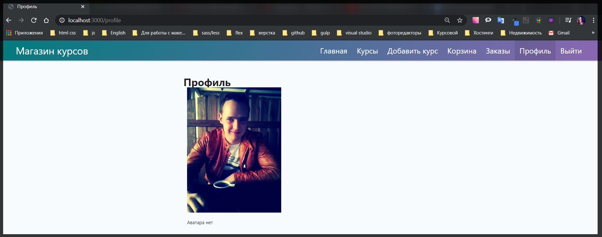

# обработка ошибки 404

Обработка данной ошибки не является валидацией, но является хорошим **user expirientce** хорошей практикой. Сейчас если я перейду на не существующий роут я получу сломаное приложение.


**express** отвечает что не может найти такой роут. Однако для пользователя это выглядит не очень хорошо.

В папке **views** я создаю файл **404.hbs**

```handlebars
{{!-- views 404.hbs --}}
<h1>404 Ошибка</h1>
<p>Страница не найдена</p>

<a href="/">Перейдите на главную страницу</a>
```

Далее в папке **middleware** создаю файл **error.js**. И посути это будет функция т.е. обычный **middleware**, т.е. мы его экспортируем как обычную функцию **module.exports = function(req, res, next){}**. И здесь все что нам потребуется задать объекту **res.status(404)** потому что у нас страница не найдена, и с помощью метода **.render('404')** отрендерить 404 шаблон, куда я вторым параметром через объект указываю параметры **title: 'Страница не найдена'**

```js
module.exports = function (req, res, next) {
  res.status(404).render('404', {
    title: 'Страница не найдена',
  });
};
```

Теперь важный момент!!!

В файле **index.js** мы должны подключить данный **middleware const errorHandler = require('./middleware/error');**

И теперь **errorHandler** это у нас функция **middleware** для **express**. Но ее нужно подключить в самом конце после того как мы зарегистрировали все остальные роуты **app.use(errorHandler);** Иначе некторое роуты будут недоступны.

```js
// index.js

const express = require('express');
const Handlebars = require('handlebars');
const path = require('path');
const csrf = require('csurf');
const flash = require('connect-flash');
const mongoose = require('mongoose');
const exphbs = require('express-handlebars');
const {
  allowInsecurePrototypeAccess,
} = require('@handlebars/allow-prototype-access');
const session = require('express-session');
const MongoStore = require('connect-mongodb-session')(session);

const homeRoutes = require('./routes/home');
const cardRoutes = require('./routes/card');
const addRouters = require('./routes/add');
const ordersRoutes = require('./routes/orders');
const coursesRotes = require('./routes/courses');
const authRoutes = require('./routes/auth');
const warMiddleware = require('./middleware/variables');
const userMiddleware = require('./middleware/user');
const errorHandler = require('./middleware/error');
const keys = require('./keys');

const PORT = process.env.PORT || 3000;

const app = express();
const hbs = exphbs.create({
  defaultLayout: 'main',
  extname: 'hbs',
  helpers: require('./utils/hbs-helpers'),
  handlebars: allowInsecurePrototypeAccess(Handlebars),
});

const store = new MongoStore({
  collection: 'sessions',
  uri: keys.MONGODB_URI,
});

app.engine('hbs', hbs.engine); // регистрирую движок
app.set('view engine', 'hbs'); // с помощью set начинаю использовать движок
app.set('views', 'views'); // первый параметр заношу переменную, а второй название папки в которой веду разработку. Название может быть любым

app.use(express.static(path.join(__dirname, 'public'))); // делаю папку public публичной а не динамической для того что бы express ее не обрабатывал
app.use(express.urlencoded({ extended: true })); // данный метод использую при обработке POST запроса формы добавления курса
app.use(
  session({
    secret: keys.SESSION_SECRET,
    resave: false,
    saveUninitialized: false,
    store,
  })
);
app.use(csrf());
app.use(flash());
app.use(warMiddleware);
app.use(userMiddleware);

app.use('/', homeRoutes); // использую импортированный роут
app.use('/add', addRouters); // использую импортированный роут
app.use('/courses', coursesRotes); // использую импортированный роут
app.use('/card', cardRoutes); // регистрирую корзину
app.use('/orders', ordersRoutes);
app.use('/auth', authRoutes);

app.use(errorHandler);

async function start() {
  try {
    await mongoose.connect(keys.MONGODB_URI, {
      useNewUrlParser: true,
      useUnifiedTopology: true,
      useFindAndModify: false,
    }); // это было подключение к БД

    app.listen(PORT, () => {
      console.log(`Сервер запущен на порту ${PORT}`);
    });
  } catch (e) {
    console.log(e);
  }
}
start();
```


