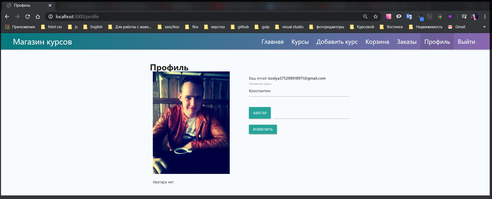

# Создание страницы профиля.

Теперь разберемся как можно в **NodeJS** загружать определенные файлы. И для этого я создам страницу профиля где будет возможность редактировать информацию по пользователю который сейчас находится в сессии и загружать ему какую - то картинку.

В папке views создаю файл profile.hbs

```handkebars
{{!-- views profile.hbs --}}

<h1>Профиль</h1>
```

И дальше необходимо создать в папке **routes profile.js**. Здесь как обычно создаю обычный роут и тем самым я подготовлю страницу профиля. **const { Router } = require('express');** Далее как обычно создаем сам роутер **const router = Router();** от функции **Router()**. И после c помощью **module.exports = router;** экспортирую его наружу.
Помимо этого мне сразу панадобится **middleware** который защищает роуты **const auth = require('../middleware/auth');**

```js
// routes profile.js

const { Router } = require('express');
const auth = require('../middleware/auth');
const router = Router();

module.exports = router;
```

Сейчас сделаю простой **router.get('/', async(req,res) =>{})**. М как обычно с помощью объекта **res.render('profile',{})**. Задаю параметры **title: 'Профиль', isProfile: true**для того что бы обозначить активную ссылку в навигации, и здесь так же понадобится объект пользователя что бы мы понимали какие данные есть у конкретного пользователя **user: req.user.toObject()** что бы привести к объекту который понимает **front - end** без лишних данных, и выводить уже конкретные данные.

```js
// routes profile.js

const { Router } = require('express');
const auth = require('../middleware/auth');
const router = Router();

router.get('/', async (req, res) => {
  res.render('profile', {
    title: 'Профиль',
    isProfile: true,
    user: req.user.toObject(),
  });
});

module.exports = router;
```

Так же будет метод **router.post** который будет обрабатывать форму **router.post('/', async (req, res) => {});** Ну и пока то я здесь ничего писать не буду.

```js
// routes profile.js

const { Router } = require('express');
const auth = require('../middleware/auth');
const router = Router();

router.get('/', async (req, res) => {
  res.render('profile', {
    title: 'Профиль',
    isProfile: true,
    user: req.user.toObject(),
  });
});

router.post('/', async (req, res) => {});

module.exports = router;
```

Теперь в файле **index.js** необходимо подключить данный **const profileRoutes = require('./routes/profile');** И подключаю его где я подключаю все роуты.

```js
// index.js

const express = require('express');
const Handlebars = require('handlebars');
const path = require('path');
const csrf = require('csurf');
const flash = require('connect-flash');
const mongoose = require('mongoose');
const exphbs = require('express-handlebars');
const {
  allowInsecurePrototypeAccess,
} = require('@handlebars/allow-prototype-access');
const session = require('express-session');
const MongoStore = require('connect-mongodb-session')(session);

const homeRoutes = require('./routes/home');
const cardRoutes = require('./routes/card');
const addRouters = require('./routes/add');
const ordersRoutes = require('./routes/orders');
const coursesRotes = require('./routes/courses');
const authRoutes = require('./routes/auth');
const profileRoutes = require('./routes/profile');
const warMiddleware = require('./middleware/variables');
const userMiddleware = require('./middleware/user');
const errorHandler = require('./middleware/error');
const keys = require('./keys');

const PORT = process.env.PORT || 3000;

const app = express();
const hbs = exphbs.create({
  defaultLayout: 'main',
  extname: 'hbs',
  helpers: require('./utils/hbs-helpers'),
  handlebars: allowInsecurePrototypeAccess(Handlebars),
});

const store = new MongoStore({
  collection: 'sessions',
  uri: keys.MONGODB_URI,
});

app.engine('hbs', hbs.engine); // регистрирую движок
app.set('view engine', 'hbs'); // с помощью set начинаю использовать движок
app.set('views', 'views'); // первый параметр заношу переменную, а второй название папки в которой веду разработку. Название может быть любым

app.use(express.static(path.join(__dirname, 'public'))); // делаю папку public публичной а не динамической для того что бы express ее не обрабатывал
app.use(express.urlencoded({ extended: true })); // данный метод использую при обработке POST запроса формы добавления курса
app.use(
  session({
    secret: keys.SESSION_SECRET,
    resave: false,
    saveUninitialized: false,
    store,
  })
);
app.use(csrf());
app.use(flash());
app.use(warMiddleware);
app.use(userMiddleware);

app.use('/', homeRoutes); // использую импортированный роут
app.use('/add', addRouters); // использую импортированный роут
app.use('/courses', coursesRotes); // использую импортированный роут
app.use('/card', cardRoutes); // регистрирую корзину
app.use('/orders', ordersRoutes);
app.use('/auth', authRoutes);
app.use('/profile', profileRoutes);

app.use(errorHandler);

async function start() {
  try {
    await mongoose.connect(keys.MONGODB_URI, {
      useNewUrlParser: true,
      useUnifiedTopology: true,
      useFindAndModify: false,
    }); // это было подключение к БД

    app.listen(PORT, () => {
      console.log(`Сервер запущен на порту ${PORT}`);
    });
  } catch (e) {
    console.log(e);
  }
}
start();
```

Теперь репехожу в папку **views** и корректрирую **navbar.hbs**

```handlebars
{{#if isProfile}}
            <li class="active"><a href="/profile">Профиль</a></li>
            {{else}}
            <li><a href="/profile">Профиль</a></li>
            {{/if}}
```

Весь файл

```handlebars
{{!-- partials navbar.hbs --}}
<nav>
    <div class="nav-wrapper">
        <a href="/" class="brand-logo">Магазин курсов</a>
        <ul id="nav-mobile" class="right hide-on-med-and-down">

            {{#if isHome}}
            <li class="active"><a href="/">Главная</a></li>
            {{else}}
            <li><a href="/">Главная</a></li>
            {{/if}}

            {{#if isCourses}}
            <li class="active"><a href="/courses">Курсы</a></li>
            {{else}}
            <li><a href="/courses">Курсы</a></li>
            {{/if}}

            {{#if isAuth}}
            {{#if isAdd}}
            <li class="active"><a href="/add">Добавить курс</a></li>
            {{else}}
            <li><a href="/add">Добавить курс</a></li>
            {{/if}}


            {{#if isCard}}
            <li class="active"><a href="/card">Корзина</a></li>
            {{else}}
            <li><a href="/card">Корзина</a></li>
            {{/if}}

            {{#if isOrder}}
            <li class="active"><a href="/orders">Заказы</a></li>
            {{else}}
            <li><a href="/orders">Заказы</a></li>
            {{/if}}

            {{#if isProfile}}
            <li class="active"><a href="/profile">Профиль</a></li>
            {{else}}
            <li><a href="/profile">Профиль</a></li>
            {{/if}}

            <li><a href="/auth/logout">Выйти</a></li>
            {{else}}
            {{#if isLogin}}
            <li class="active"><a href="/auth/login#login">Войти</a></li>
            {{else}}
            <li><a href="/auth/login#login">Войти</a></li>
            {{/if}}
            {{/if}}
        </ul>
    </div>
</nav>
```


Теперь необходимо задать определенную структуру для данной страницы. Ставлю временный аватар

```handlebars
{{!-- views profile.hbs --}}
<div class="profile">
<h1>Профиль</h1>

<div class="row">
    <div class="col s6">
        
        <p>Аватара нет</p>
    </div>

    <div class="col s6"></div>
</div>
</div>
```


Теперь необходимо реализовать форму которая будет находится справо

```js
{{!-- views profile.hbs --}}
<div class="profile">
    <h1>Профиль</h1>

    <div class="row">
        <div class="col s6">
            
            <p>Аватара нет</p>
        </div>


        <div class="col s6">
            <form action="/profile" method="POST">
                <p>Ваш email: <strong>{{user.email}}</strong></p>
                <div class="input-field">
                    <input id="name" name="name" type="text" class="validate" required value="{{user.name}}" />
                    <label for="name">Ваше имя</label>
                    <span class="helper-text" data-error="Введите имя пользователя"></span>
                </div>
                <div class="file-field input-field">
                    <div class="btn">
                        <span>Аватар</span>
                        <input type="file" name="avatar">
                    </div>
                    <div class="file-path-wrapper">
                        <input class="file-path validate" type="text">
                    </div>
                </div>
                 <input type="hidden" name="_csrf" value="{{csrf}}">
                 <button class="btn" type="submit">Изменить</button>
            </form>
        </div>
    </div>
</div>
```



При клике на кнопку Аватар мы можем загружать какой - то аватар. При нажатии на кнопку изменить будет отправляться **POST** запрос.

Теперь осталось обработать **post** запрос и понять как работать с файлами.
