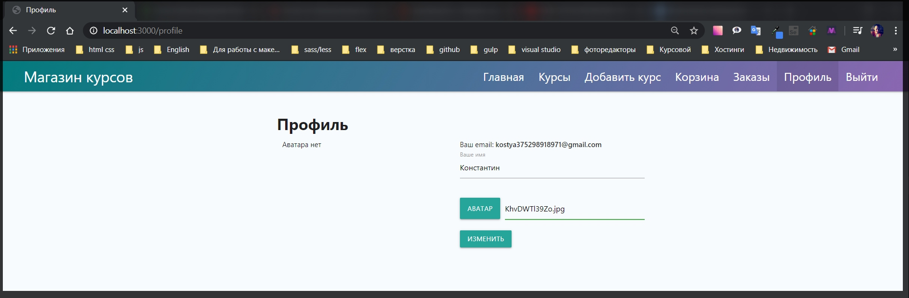
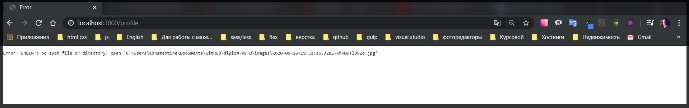
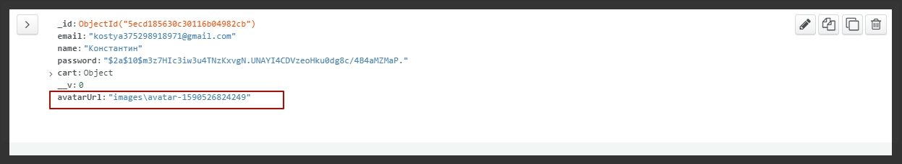

# Загрузка файлов

Теперь необходимо реализовать роут для того что бы **file upload** у нас работал. Перехожу в **profile.js**. И в первую очередь перед асинхронными функциями добавляю **auth**. Это делается для того что бы у нас не авторизованные пользователи не могли отправлять **post** запросы и соответственно получать и просматривать страницу профиля.

```js
// routes profile.js

const { Router } = require('express');
const auth = require('../middleware/auth');
const router = Router();

router.get('/', auth, async (req, res) => {
  res.render('profile', {
    title: 'Профиль',
    isProfile: true,
    user: req.user.toObject(),
  });
});

router.post('/', auth, async (req, res) => {});

module.exports = router;
```

Теперь обрабатываю **post** запрос в первую очередь оборачиваем в блок **try catch**

```js
// routes profile.js

const { Router } = require('express');
const auth = require('../middleware/auth');
const router = Router();

router.get('/', auth, async (req, res) => {
  res.render('profile', {
    title: 'Профиль',
    isProfile: true,
    user: req.user.toObject(),
  });
});

router.post('/', auth, async (req, res) => {
  try {
  } catch (e) {
    console.log(e);
  }
});

module.exports = router;
```

И в первую очередь необходимо получить объект пользователя у которого мы будем изменять какие - то данные. Модель **User** кстати необходимо импортировать **const User = require('../models/user');**

И теперь я могу обратиться к модели пользователя **const user = await User**. вызываю метод **findById()** куда я передаю **id** текущего пользователя из объекта **req.user.\_id**.
После получения пользователя я буду у него изменять определенные поля. В конце я сделаю **Object.assign(user,)** Вторым параметром я передаю объект к примеру который будет называться **toChange** который я сейчас создам. И после этого ждем когда пользователь сохранится в БД **await user.save()**. После того как пользователь сохранится делаю **res.redirect('/profile')**

```js
// routes profile.js

const { Router } = require('express');
const auth = require('../middleware/auth');
const User = require('../models/user');
const router = Router();

router.get('/', auth, async (req, res) => {
  res.render('profile', {
    title: 'Профиль',
    isProfile: true,
    user: req.user.toObject(),
  });
});

router.post('/', auth, async (req, res) => {
  try {
    const user = await User.findById(req.user._id);

    Object.assign(user, toChange);
    await user.save();
    res.redirect('/profile');
  } catch (e) {
    console.log(e);
  }
});

module.exports = router;
```

Теперь что касается **const toChange = {}** поле **name:** которое я буду получать из объекта **req.body.name**. Т.е. оно береться из **views profile.hbs** с

```handlebars
 <input id="name" name="name" type="text" class="validate" required value="{{user.name}}" />
```

Как раз таки его мы и будем менять.

И дальше пишу проверку. Если **if** в объекте **req.file**, то тогда объекту **toChange**. его полю **avatarUrl =** будем заносить значение **''** пока пустой строки.

```js
// routes profile.js

const { Router } = require('express');
const auth = require('../middleware/auth');
const User = require('../models/user');
const router = Router();

router.get('/', auth, async (req, res) => {
  res.render('profile', {
    title: 'Профиль',
    isProfile: true,
    user: req.user.toObject(),
  });
});

router.post('/', auth, async (req, res) => {
  try {
    const user = await User.findById(req.user._id);

    const toChange = {
      name: req.body.name,
    };

    console.log(req.file);

    if (req.file) {
      toChange.avatarUrl = '';
    }

    Object.assign(user, toChange);
    await user.save();
    res.redirect('/profile');
  } catch (e) {
    console.log(e);
  }
});

module.exports = router;
```

Для начало делаю **console.log(req.file)** для того что бы убедится в том что он у нас существует и что я действительно подключил **muter** правильно. и в модели пользователя добавлю еще одно свойство **avatarUrl** потому что сейчас его нет. **models user.js** добавляю **avatarUrl: String,** он не обязательный.

```js
// models userSchema.js
const { Schema, model } = require('mongoose');

const userSchema = new Schema({
  email: {
    type: String,
    required: true,
  },
  name: String,
  password: {
    type: String,
    required: true,
  },
  avatarUrl: String,
  resetToken: String,
  resetTokenExp: Date,
  cart: {
    items: [
      {
        count: {
          type: Number,
          required: true,
          default: 1,
        },
        courseId: {
          type: Schema.Types.ObjectId,
          ref: 'Course',
          required: true,
        },
      },
    ],
  },
});

userSchema.methods.addToCart = function (course) {
  const items = [...this.cart.items];
  const idx = items.findIndex((c) => {
    return c.courseId.toString() === course._id.toString();
  });

  if (idx >= 0) {
    items[idx].count = items[idx].count + 1;
  } else {
    items.push({
      courseId: course._id,
      count: 1,
    });
  }

  this.cart = { items };
  return this.save();
};

userSchema.methods.removeFromCart = function (id) {
  let items = [...this.cart.items];
  const idx = items.findIndex((c) => c.courseId.toString() === id.toString());

  if (items[idx].count === 1) {
    items = items.filter((c) => c.courseId.toString() !== id.toString());
  } else {
    items[idx].count--;
  }

  this.cart = { items };
  return this.save();
};

userSchema.methods.clearCart = function () {
  this.cart = { items: [] };
  return this.save();
};

module.exports = model('User', userSchema);
```

Так же сейчас на странице **profile.hbs** мы можем дописать проверку Если же аватар есть то мы в значение **src** передавать значение **user.avatarUll**. Иначе вывожу параграф

```handlebars
   <div class="row">
        <div class="col s6">
            {{#if user.avatarUrl}}
            
            {{else}}
            <p>Аватара нет</p>
            {{/if}}
        </div>
```

Весь файл

```handlebars
{{!-- views profile.hbs --}}
<div class="profile">
    <h1>Профиль</h1>

    <div class="row">
        <div class="col s6">
            {{#if user.avatarUrl}}
            
            {{else}}
            <p>Аватара нет</p>
            {{/if}}
        </div>


        <div class="col s6">
            <form action="/profile" method="POST">
                <p>Ваш email: <strong>{{user.email}}</strong></p>
                <div class="input-field">
                    <input id="name" name="name" type="text" class="validate" required value="{{user.name}}" />
                    <label for="name">Ваше имя</label>
                    <span class="helper-text" data-error="Введите имя пользователя"></span>
                </div>
                <div class="file-field input-field">
                    <div class="btn">
                        <span>Аватар</span>
                        <input type="file" name="avatar">
                    </div>
                    <div class="file-path-wrapper">
                        <input class="file-path validate" type="text">
                    </div>
                </div>
                <input type="hidden" name="_csrf" value="{{csrf}}">
                <button class="btn" type="submit">Изменить</button>
            </form>
        </div>
    </div>
</div>
```

Если я сейчас попробую загрузить аватар, то в консоли выведется **undefined**.

На самом деле все просто. Тегу **form** еще нужно прописать что он еще работает с файлами для этого задаю атрибут **enctype="multipart/form-data"**

```js
{{!-- views profile.hbs --}}
<div class="profile">
    <h1>Профиль</h1>

    <div class="row">
        <div class="col s6">
            {{#if user.avatarUrl}}
            
            {{else}}
            <p>Аватара нет</p>
            {{/if}}
        </div>


        <div class="col s6">
            <form action="/profile" method="POST" enctype="multipart/form-data">
                <p>Ваш email: <strong>{{user.email}}</strong></p>
                <div class="input-field">
                    <input id="name" name="name" type="text" class="validate" required value="{{user.name}}" />
                    <label for="name">Ваше имя</label>
                    <span class="helper-text" data-error="Введите имя пользователя"></span>
                </div>
                <div class="file-field input-field">
                    <div class="btn">
                        <span>Аватар</span>
                        <input type="file" name="avatar">
                    </div>
                    <div class="file-path-wrapper">
                        <input class="file-path validate" type="text">
                    </div>
                </div>
                <input type="hidden" name="_csrf" value="{{csrf}}">
                <button class="btn" type="submit">Изменить</button>
            </form>
        </div>
    </div>
</div>
```

Теперь форма будет отправлять **post** запрос немного в другом формате.





Нет такой директории как **images**. И здесь мы уже можем заметить как формируется новое название файла. **multer** не создает папки. В корне приложения создаю папку **images**.

Сколько я не бился и не пытался у меня все равно выбрасывало ошибку о том что директория не создана. Примерное решение нашел [https://github.com/expressjs/multer/blob/master/doc/README-ru.md](https://github.com/expressjs/multer/blob/master/doc/README-ru.md)

Пришлось переписать в **middleware file.js** логику блок кода добавления файла на диск и блок кода переименовывания добавляемого
файла.

```js
// middleware file.js

const multer = require('multer');

const storage = multer.diskStorage({
  destination: function (req, file, cb) {
    cb(null, 'images');
  },
  filename: function (req, file, cb) {
    cb(null, file.fieldname + '-' + Date.now());
  },
});

const allowedTypes = ['image/png', 'image/jpg', 'image/jpeg'];

const fileFilter = (req, file, cb) => {
  if (allowedTypes.includes(file.mimetype)) {
    cb(null, true);
  } else {
    cb(null, false);
  }
};

module.exports = multer({
  storage,
  fileFilter,
});
```

Теперь при загрузке файла в консоли выдает

```
{
  fieldname: 'avatar',
  originalname: '9hFfbPwX4Sc.jpg',
  encoding: '7bit',
  mimetype: 'image/jpeg',
  destination: 'images',
  filename: 'avatar-1590526824249',
  path: 'images\\avatar-1590526824249',
  size: 163818
}
```

Это объект который представлен в виде **req.file**. И здесь написана вся информация которую мы загружаем

Привязываю картинку к пользователю **toChange.avatarUrl = req.file.path;** т.е. в случае если у нас есть какой - то файл в форме мы будем изменять. Если же ничего не отправляли то не будем искать картинку.

```js
if (req.file) {
  toChange.avatarUrl = req.file.path;
}
```



Фотография в профиле не подгружалась потому что папку **images** нужно сделать статической. Тоже самое что я делал с клинтскими скриптами и с css. Пока что **express** не понимает где нам брать данный путь. Для этого в файле **index.js** задаю еще один middleware **app.use('/images', express.static(path.join(\_\_dirname, 'images')));** если первым параметром не добавить в строковом значеии имя папки в которую мы добавляем изображения **'/images'** , то для отображения изображения **express** будет искать изображения в корне приложения а не в папке **images**.

```js
// index.js

const express = require('express');
const Handlebars = require('handlebars');
const path = require('path');
const csrf = require('csurf');
const flash = require('connect-flash');
const mongoose = require('mongoose');
const exphbs = require('express-handlebars');
const {
  allowInsecurePrototypeAccess,
} = require('@handlebars/allow-prototype-access');
const session = require('express-session');
const MongoStore = require('connect-mongodb-session')(session);

const homeRoutes = require('./routes/home');
const cardRoutes = require('./routes/card');
const addRouters = require('./routes/add');
const ordersRoutes = require('./routes/orders');
const coursesRotes = require('./routes/courses');
const authRoutes = require('./routes/auth');
const profileRoutes = require('./routes/profile');
const warMiddleware = require('./middleware/variables');
const userMiddleware = require('./middleware/user');
const errorHandler = require('./middleware/error');
const fileMiddleware = require('./middleware/file');
const keys = require('./keys');

const PORT = process.env.PORT || 3000;

const app = express();
const hbs = exphbs.create({
  defaultLayout: 'main',
  extname: 'hbs',
  helpers: require('./utils/hbs-helpers'),
  handlebars: allowInsecurePrototypeAccess(Handlebars),
});

const store = new MongoStore({
  collection: 'sessions',
  uri: keys.MONGODB_URI,
});

app.engine('hbs', hbs.engine); // регистрирую движок
app.set('view engine', 'hbs'); // с помощью set начинаю использовать движок
app.set('views', 'views'); // первый параметр заношу переменную, а второй название папки в которой веду разработку. Название может быть любым

app.use(express.static(path.join(__dirname, 'public'))); // делаю папку public публичной а не динамической для того что бы express ее не обрабатывал
app.use('/images', express.static(path.join(__dirname, 'images')));
app.use(express.urlencoded({ extended: true })); // данный метод использую при обработке POST запроса формы добавления курса
app.use(
  session({
    secret: keys.SESSION_SECRET,
    resave: false,
    saveUninitialized: false,
    store,
  })
);
app.use(fileMiddleware.single('avatar'));
app.use(csrf());
app.use(flash());
app.use(warMiddleware);
app.use(userMiddleware);

app.use('/', homeRoutes); // использую импортированный роут
app.use('/add', addRouters); // использую импортированный роут
app.use('/courses', coursesRotes); // использую импортированный роут
app.use('/card', cardRoutes); // регистрирую корзину
app.use('/orders', ordersRoutes);
app.use('/auth', authRoutes);
app.use('/profile', profileRoutes);

app.use(errorHandler);

async function start() {
  try {
    await mongoose.connect(keys.MONGODB_URI, {
      useNewUrlParser: true,
      useUnifiedTopology: true,
      useFindAndModify: false,
    }); // это было подключение к БД

    app.listen(PORT, () => {
      console.log(`Сервер запущен на порту ${PORT}`);
    });
  } catch (e) {
    console.log(e);
  }
}
start();
```

Далее в шаблоне где указываю путь к картинку нужно добавить слэш для задания относительного пути **src="/{{user.avatarUrl}}"**

```handlebars
{{!-- views profile.hbs --}}
<div class="profile">
   <h1>Профиль</h1>

<div class="row">
  <div class="col s6">
    {{#if user.avatarUrl}}
      
    {{else}}
      <p>Аватара нет</p>
    {{/if}}
  </div>

  <div class="col s6">
    <form action="/profile" method="POST" enctype="multipart/form-data">
      <p>Ваше email: <strong>{{user.email}}</strong></p>

      <div class="input-field">
        <input id="name" name="name" type="text" class="validate" required value="{{user.name}}">
        <label for="name">Ваше имя</label>
        <span class="helper-text" data-error="Имя не может быть пустым"></span>
      </div>

      <div class="file-field input-field">
        <div class="btn">
          <span>Аватар</span>
          <input type="file" name="avatar">
        </div>
        <div class="file-path-wrapper">
          <input class="file-path validate" type="text">
        </div>
      </div>

      <input type="hidden" name="_csrf" value="{{csrf}}">

      <button type="submit" class="btn">Изменить</button>
    </form>
  </div>
</div>
</div>
```
