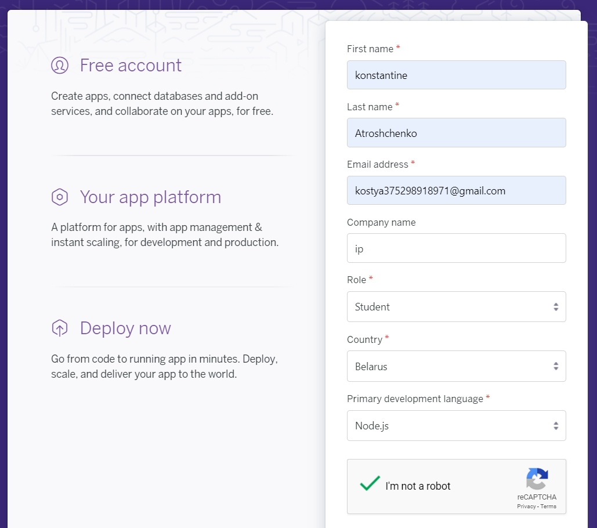
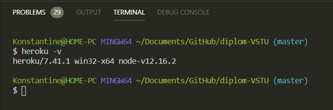
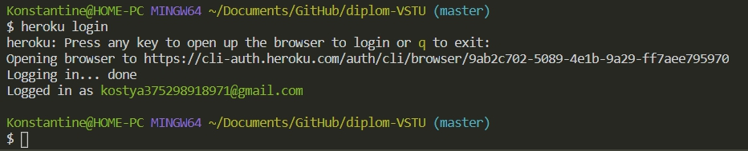
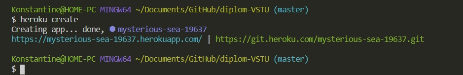
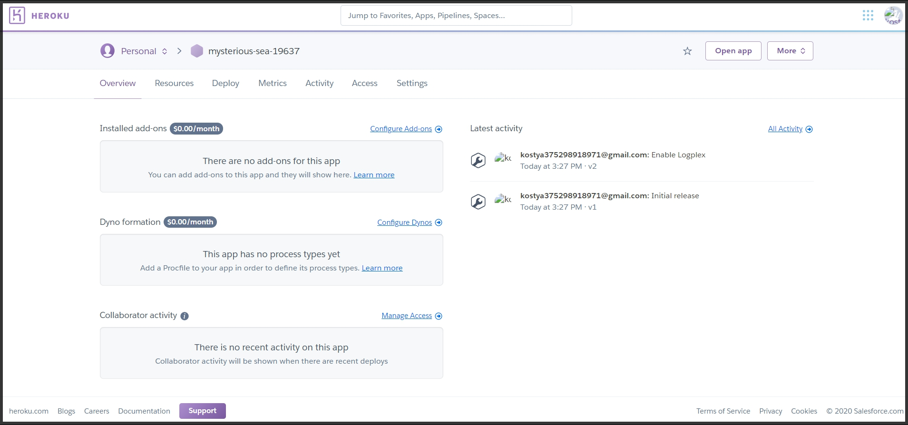
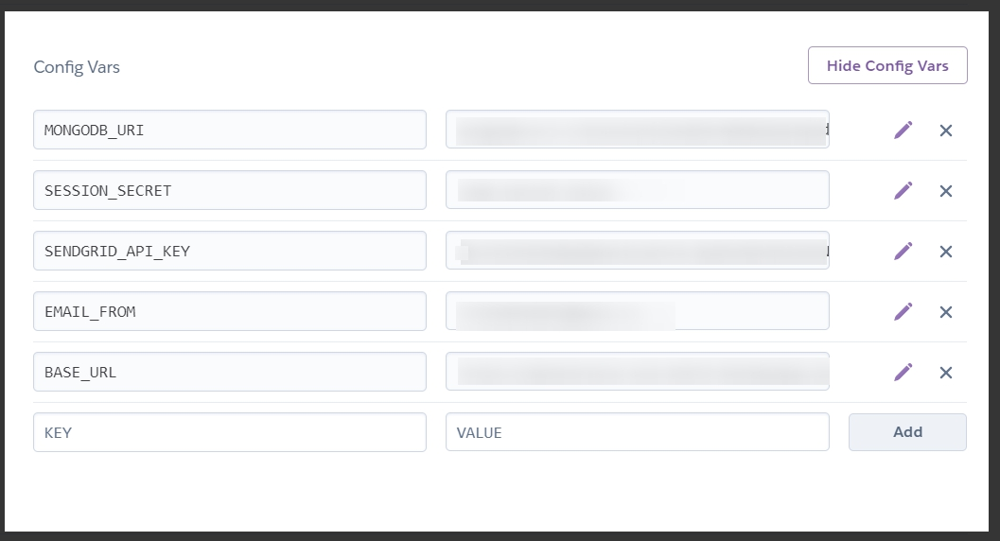
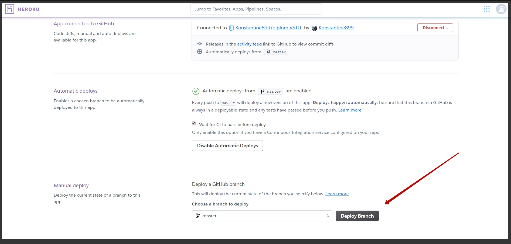

# Подготовка Heroku

Настало время заливать приложение на удаленный сервер. Регистрируюсь [Heroku](https://www.heroku.com/)

. После регистрации необходимо скачать [heroku cli](https://devcenter.heroku.com/articles/heroku-cli). Этот иструмент позволит взаимодействовать с **heroku** через консоль.

Далее в консоли проекта проверяю установился ли данный инструмент

```
heroku -v
```



Далее нужно залогинится через консоль для этого ввожу команду

```
heroku login
```

Для согласия жму рандомную кнопку и меня перекидывает на сайт где логинюсь. После этого выводится сообщение ято я могу продолжить работу в консоли.

После логина в консоль выводяться данные



После этого создаю новый проект с помощью команды **heroku create**



Задается рандомное имя проекту и выводит две ссылки.

1. ссылку на приложение [https://mysterious-sea-19637.herokuapp.com/](https://mysterious-sea-19637.herokuapp.com/) потдомен с название данного приложения которую он сгенерировал.
2. И ссылку на git [https://git.heroku.com/mysterious-sea-19637.git](https://git.heroku.com/mysterious-sea-19637.git)

Дальше если я обновлю страницу то увижу новый проект который смогу расскрыть.



Далее перехожу в поле **Deploy**где можно посмотреть как задеплоить приложение в **heroku**. Но для начало перехожу в поле **Settings** и здесь есть кнопка **Reveal Config Vars** которую необходимо нажать. Появляются два поля **KEY** и **VALUE** куда мы должны занести определенные конфигурации и переменные для того что бы наше приложение работало. Из файла **keys.dev.js** переношу данные ключи и значения. С ключем **BASE_URL** есть определенный нюанс. Сейчас уже не будем переадресовывать на **localhost**. Необходимо переадресовывать именно на сервис **heroku** и для этого в качестве значения передаю ссылку на потдомен с название данного приложения которую он сгенерировал только в конце если есть слэш нужно его убрать.



Далее перехожу в поле **Deploy** и первое что нужно сделать это проинициализировать систему контроля версий **git** для приложения. но перед этим в корне приложения создаю файл **.gitignore** и заношу туда данные которые не должны попасть репозиторий.

Инициализирую проект

```
git init
```

ДОбавляю все файлы в текущий проект

```
git add .
```

После этого делаю комит что бы зафиксировать изменения. В двойных кавычках название комита

```
git commit -am "initial"
```

В package.json проверяю на наличие скрипта **"start": "node index.js"**, для того что бы запустить **heroku**

```json
"scripts": {
    "start": "node index.js",
    "dev": "nodemon index.js",
    "lint": "eslint ./",
    "lint-fix": "eslint ./ --fix"
  },
```

После этого пушу изменения

```
git push heroku master
```

но для этого необходимо для начало добавить удаленный **git**

```
heroku git: remote - floating-waters-28347
```

Если не выводится задеплоиный сайт в **MongoDB** в белом списке **ip** адресов выставь все оп нолям. Тем самым разрешишь подключение с любоко **ip** адреса.

Все изменения в гите пропихиваю вручную.


