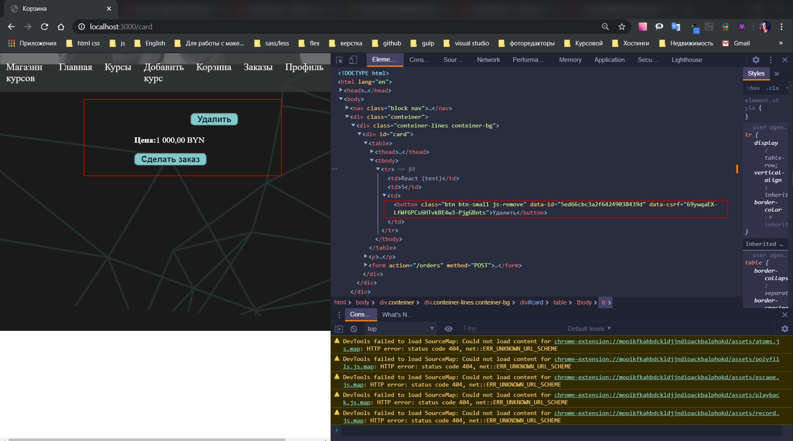
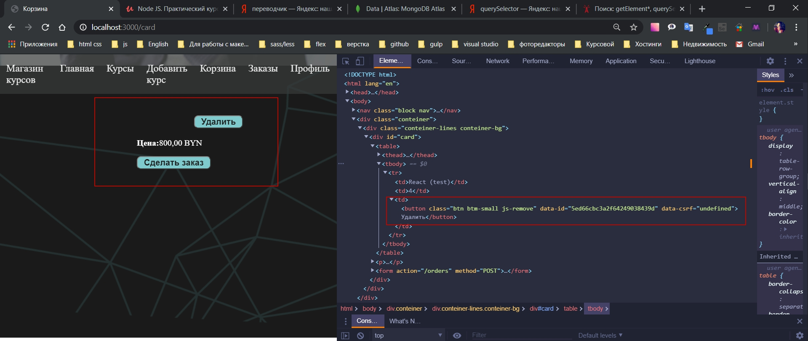
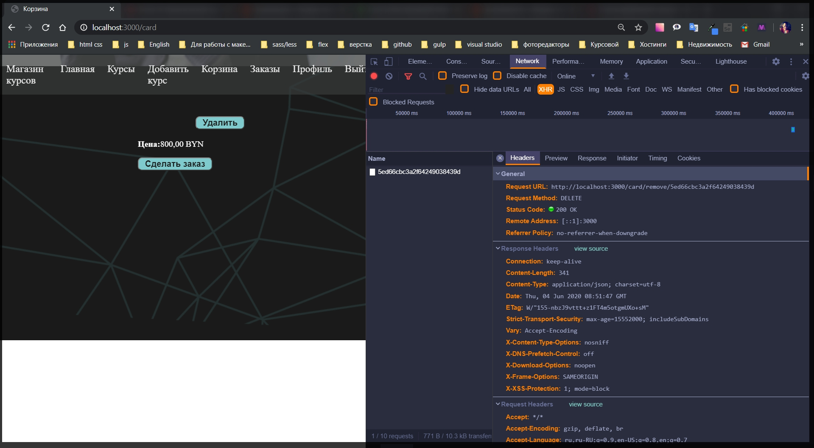
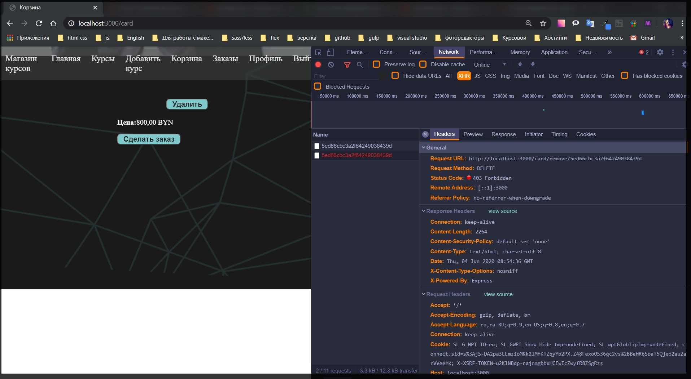
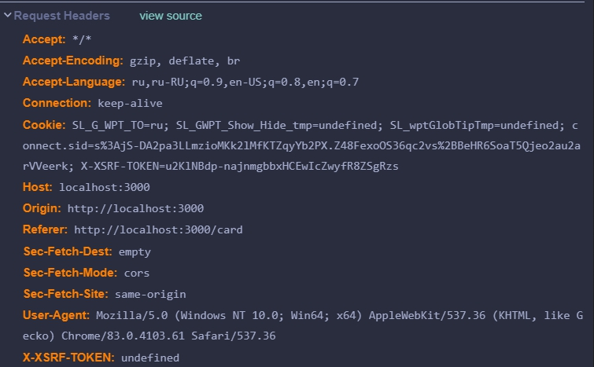
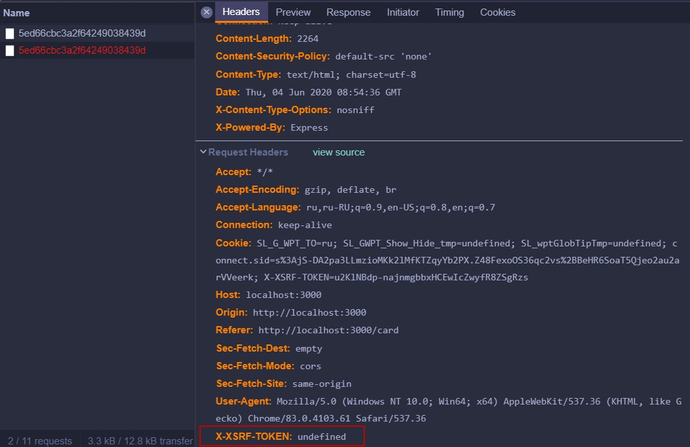
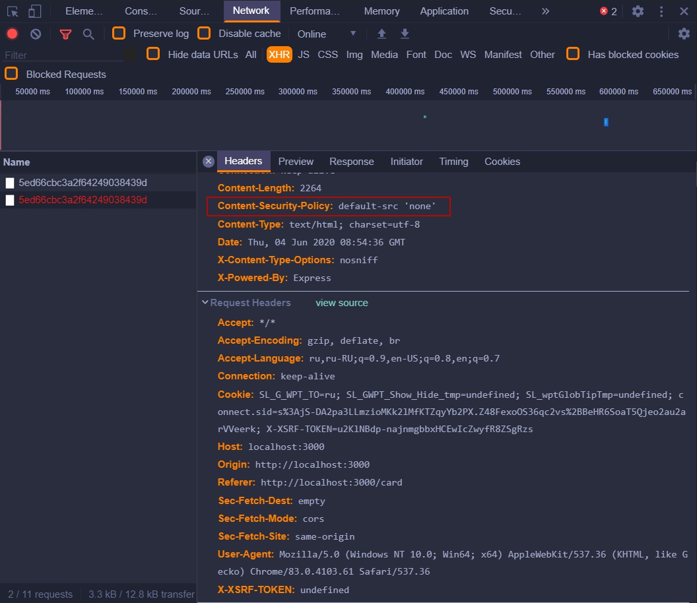

И так ошибка заключается в том что при первом удалении сгенертрованный в базе данных ключ безопасности csrf, который я принудительно прописал в input, генерируется и добавляется в значение data-csrf. Происходит сверка ключей в БД и удаление происходит корректно. Однако после первого удаления сумма меняется корректно однако значение ключа больше не генерируется и в значение data-csrf="undefined"









Я грешил на то что что ключи в БД генерируются, но каким - то способом не попадают на front -end. Лишь после ручной перезагрузки страницы token csrf снова генерировался и удаление снова происходило успешно. Искал способ автоматической перезагрузки страницы при событии клика с помощью которго происходило удаление с последующей перезагрузкой страницы.



Менял поля в header на другие значения

```js
// public app.js

const toCurrency = (price) => {
  return new Intl.NumberFormat('ru-RU', {
    currency: 'BYN',
    style: 'currency',
  }).format(price);
};

const toDate = (date) => {
  return new Intl.DateTimeFormat('ru-RU', {
    day: '2-digit',
    month: 'long',
    year: 'numeric',
    hour: '2-digit',
    minute: '2-digit',
    second: '2-digit',
  }).format(new Date(date));
};

document.querySelectorAll('.price').forEach((node) => {
  node.textContent = toCurrency(node.textContent);
});

document.querySelectorAll('.date').forEach((node) => {
  node.textContent = toDate(node.textContent);
});

const $card = document.querySelector('#card');

if ($card) {
  $card.addEventListener('click', (event) => {
    if (event.target.classList.contains('js-remove')) {
      const id = event.target.dataset.id;
      const csrf = event.target.dataset.csrf;

      fetch('/card/remove/' + id, {
        method: 'delete',
        headers: {
          'X-XSRF-TOKEN': csrf,
        },
      })
        .then((res) => res.json())
        .then((card) => {
          if (card.courses.length) {
            const html = card.courses
              .map((c) => {
                return `
                <tr>
                  <td>${c.title}</td>
                  <td>${c.count}</td>
                  <td>
                    <button class="btn btm-small js-remove" data-id="${c.id}" data-csrf="${c.csrf}">Удалить</button>
                  </td>
                </tr>
                `;
              })
              .join('');
            $card.querySelector('tbody').innerHTML = html;
            $card.querySelector('.price').textContent = toCurrency(card.price);
          } else {
            $card.innerHTML = '<p>Корзина пуста</p>';
          }
        });
    }
  });
}

M.Tabs.init(document.querySelectorAll('.tabs'));
```



Пробовал прописывать политику безопасности в различных конфигурациях метатегов. И много другое.

Оказалось что в блоке кода где я генерирую новую страницу $card.querySelector('tbody').innerHTML = html; $card.querySelector('.price').textContent = toCurrency(card.price); Я везде использовал метод querySelector который в свою очередь ведет поиск по всем значения объекта которые до этого были преобразованы в одну большую строку. Однако хоть он и ведет поиск по всему массиву берет лишь одно найденное значение и прекращает поиск. Т.е. он находит один курс и заканчивает на этом свое действие. Поэтому после удаления курса он не выполняет дальнейшего поиска по массиву и выводит csrf undefined а id курса остается старым т.к. он переходит на новый элемент массива с таким же id курса.
При исправлении на метод querySelectorAll он не останавлявается при нахождении первого элемента, а продолжает поиск после Event delete тем самым генерируя ключ csrf. Сводится сверка ключей в БД и удаление происходит успешно.

Данный метод не работает с ценой. Т.к. проходя по курсу он кокотенирует все значения цен и не декрементирует значения при удалении. Однако если оставить querySelector он будет при каждом удаленнии заново пересчитывать все элементы массива и конкотенировать их тем самым пересчитывать цену.

```js
// public app.js

const toCurrency = (price) => {
  return new Intl.NumberFormat('ru-RU', {
    currency: 'BYN',
    style: 'currency',
  }).format(price);
};

const toDate = (date) => {
  return new Intl.DateTimeFormat('ru-RU', {
    day: '2-digit',
    month: 'long',
    year: 'numeric',
    hour: '2-digit',
    minute: '2-digit',
    second: '2-digit',
  }).format(new Date(date));
};

document.querySelectorAll('.price').forEach((node) => {
  node.textContent = toCurrency(node.textContent);
});

document.querySelectorAll('.date').forEach((node) => {
  node.textContent = toDate(node.textContent);
});

const $card = document.querySelector('#card');

if ($card) {
  $card.addEventListener('click', (event) => {
    if (event.target.classList.contains('js-remove')) {
      const id = event.target.dataset.id;
      const csrf = event.target.dataset.csrf;

      fetch('/card/remove/' + id, {
        method: 'delete',
        headers: {
          'X-XSRF-TOKEN': csrf,
        },
      })
        .then((res) => res.json())
        .then((card) => {
          if (card.courses.length) {
            const html = card.courses
              .map((c) => {
                return `
                <tr>
                  <td>${c.title}</td>
                  <td>${c.count}</td>
                  <td>
                    <button class="btn btm-small js-remove" data-id="${c.id}" data-csrf="${c.csrf}">Удалить</button>
                  </td>
                </tr>
                `;
              })
              .join('');
            $card.querySelectorAll('tbody').innerHTML = html;
            $card.querySelector('.price').textContent = toCurrency(card.price);
          } else {
            $card.innerHTML = '<p>Корзина пуста</p>';
          }
        });
    }
  });
}

M.Tabs.init(document.querySelectorAll('.tabs'));
```

Нормальное решение с рабочим счетчиком добавляю

```
 data-csrf="${csrf}"
 если добавить data-csrf="${с.csrf}" то не сработает
```

рабочий файл

```js
// public app.js

const toCurrency = (price) => {
  return new Intl.NumberFormat('ru-RU', {
    currency: 'BYN',
    style: 'currency',
  }).format(price);
};

const toDate = (date) => {
  return new Intl.DateTimeFormat('ru-RU', {
    day: '2-digit',
    month: 'long',
    year: 'numeric',
    hour: '2-digit',
    minute: '2-digit',
    second: '2-digit',
  }).format(new Date(date));
};

document.querySelectorAll('.price').forEach((node) => {
  node.textContent = toCurrency(node.textContent);
});

document.querySelectorAll('.date').forEach((node) => {
  node.textContent = toDate(node.textContent);
});

const $card = document.querySelector('#card');

if ($card) {
  $card.addEventListener('click', (event) => {
    if (event.target.classList.contains('js-remove')) {
      const id = event.target.dataset.id;
      const csrf = event.target.dataset.csrf;

      fetch('/card/remove/' + id, {
        method: 'delete',
        headers: {
          'X-XSRF-TOKEN': csrf,
        },
      })
        .then((res) => res.json())
        .then((card) => {
          if (card.courses.length) {
            const html = card.courses
              .map((c) => {
                return `
                <tr>
                  <td>${c.title}</td>
                  <td>${c.count}</td>
                  <td>
                    <button class="btn btm-small js-remove" data-id="${c.id}" data-csrf="${csrf}">Удалить</button>
                  </td>
                </tr>
                `;
              })
              .join('');
            $card.querySelector('tbody').innerHTML = html;
            $card.querySelector('.price').textContent = toCurrency(card.price);
          } else {
            $card.innerHTML = '<p>Корзина пуста</p>';
          }
        });
    }
  });
}

M.Tabs.init(document.querySelectorAll('.tabs'));
```
